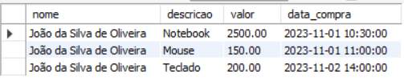
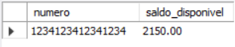
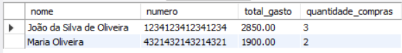
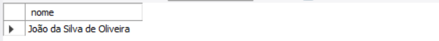

Gerenciamento de Banco de Dados - Sistema de Compras

💡 Sobre o Projeto
Este repositório contém scripts SQL para a criação e manipulação de um banco de dados voltado para o gerenciamento de compras realizadas por clientes através de cartões de crédito. 
Abaixo, você encontrará uma documentação detalhada sobre cada script, tabelas criadas e consultas realizadas.

O foco do projeto está em fortalecer os conhecimentos sobre banco de dados SQL, sobre criação de tabelas em SQL, definição de atributos e tipo de dados, consultas SQL.

📁 Estrutura do Projeto
  
 -> tabelas.sql: Contém os comandos para criação das tabelas do banco de dados.

 -> consultas.sql: Inclui diversas consultas realizadas no banco de dados, com explicações e exemplos de saídas.
 

🛠️ Tabelas Criadas

🧑‍💼 Tabela cliente

Descrição: Armazena informações sobre os clientes.
Colunas:

    cliente_id (INT, PK): Identificador único do cliente.

    nome (VARCHAR): Nome do cliente.

    cpf (CHAR): CPF único do cliente.

    data_nascimento (DATE): Data de nascimento do cliente.
   

💳 Tabela cartao

Descrição: Armazena informações sobre os cartões de crédito dos clientes.
Colunas:

    cartao_id (INT, PK): Identificador único do cartão.

    numero (CHAR): Número único do cartão.

    limite (DECIMAL): Limite de crédito do cartão.

    saldo_disponivel (DECIMAL): Saldo disponível no cartão.

    id_cliente (INT, FK): Relaciona o cartão a um cliente.

🛒 Tabela compra

Descrição: Registra as compras realizadas pelos clientes.
Colunas:

    compra_id (INT, PK): Identificador único da compra.

    descricao (VARCHAR): Descrição da compra.

    valor (DECIMAL): Valor da compra.

    data_compra (DATETIME): Data e hora da compra.

    id_cartao (INT, FK): Relaciona a compra a um cartão.
    

🔍 Consultas Realizadas

 📝 Consulta para listar todas as compras realizadas por um cliente específico:

 📝 Consulta que mostra o saldo disponível de um cartão após todas as compras:

📝 Consulta que exibe um resumo detalhado das compras realizadas por cliente:

📝 Consulta que pesquisa o cliente com compra acima de R$ 2.000,00:

📖 Como Executar o Projeto

1. Clone este repositório em sua máquina local:

   git clone <URL_DO_REPOSITORIO>

3. Abra o arquivo tabelas.sql em seu editor SQL preferido e execute os comandos para criar as tabelas.

4. Insira os dados necessários nas tabelas conforme sua necessidade.

5. Execute as consultas no arquivo consultas.sql para verificar os resultados.

❓ Por Que Este Projeto?

Este projeto foi desenvolvido para:

📚 Aprender SQL: Explorar a criação de tabelas, definição de atributos e tipos de dados.

🔍 Praticar Consultas: Realizar consultas SQL para manipular e extrair informações do banco de dados.

💡 Entender Banco de Dados: Desenvolver uma base sólida no uso de SQL para projetos reais.

📬 Contato Gostou do projeto? Quer conversar mais? Entre em contato comigo! 
📧 Email: sa_muelmarcos@hotmail.com 💼 LinkedIn: www.linkedin.com/in/samuel-marcos-almeida 📂 GitHub: www.linkedin.com/in/samuel-marcos-almeida

